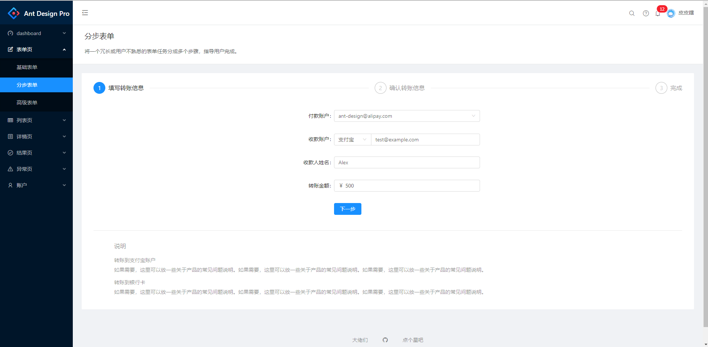

# react-app

使用 webpack 自行搭建 react 环境，使用 react 16.4 + react-router 4.3 + typescript + mobx 实现 antd-pro
\
使用 node + mock 模拟数据

## 启动项目

```sh
获取项目
$ git clone https://github.com/Jackyzm/react-app-ts.git

进入目录
$ cd react-app-ts

安装依赖
$ yarn install

启动项目
$ yarn start

启动模拟数据
$ yarn serve

在浏览器中输入 http://localhost:8000
```

## 项目示例如下

（使用 ts+mobx 仿 ant-pro）



